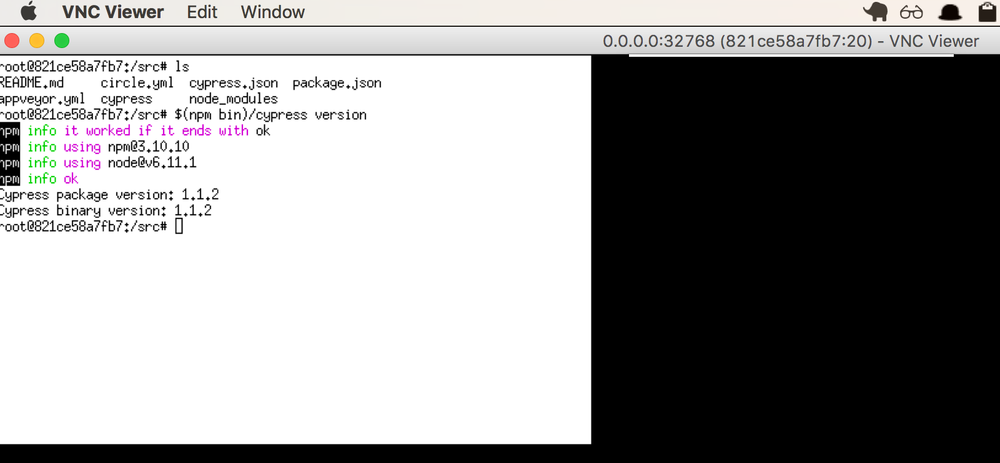
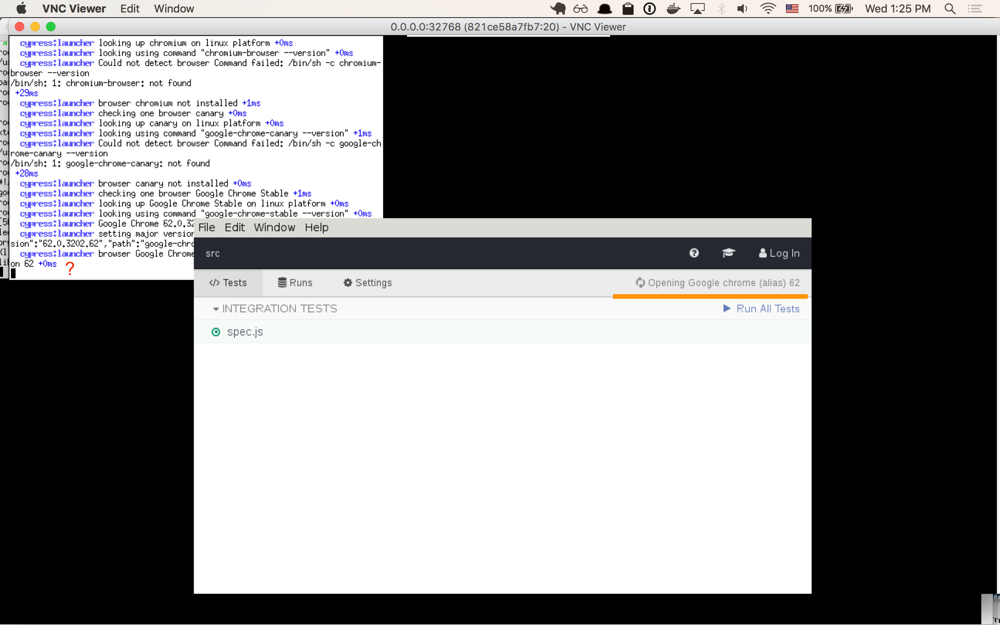

# browser-connect-experiment
> Debugging Docker on Mac Chrome to Cypress connection time out

## Build Docker image

See [Dockerfile](Dockerfile)

```
npm run build
```

Which creates an image named `cypress-chrome-vnc`

## Run Docker image

Switch into a folder with Cypress tests, for example grab
[cypress-test-tiny](https://github.com/cypress-io/cypress-test-tiny)

```
git clone git@github.com:cypress-io/cypress-test-tiny.git
cd cypress-test-tiny
docker run -p 5900 -e HOME=/ -v $PWD:/src -w /src cypress-chrome-vnc x11vnc -forever -create
```

It shows that VNC is running on local (to the container) port `5900`, but we do
not know the external container IP and port. To find it:

```
docker ps
... PORT
    0.0.0.0:32768->5900/tcp
```

Open VNC client, for example the free 'RealVNC' client from https://www.realvnc.com
and enter `0.0.0.0:32768` url. Click to allow connecting over unencrypted
connection without a password and see the desktop. You should have a terminal shell
with outside files mapped into `/src` folder. Install Cypress (via `npm i` or
`npm i cypress`) and you should be able to see its version.



## Investigation

Terminal `$TERM` is set to `xterm`

Cypress verifies, although with weird characters:

```
root@821ce58a7fb7:/src# $(npm bin)/cypress verify
npm info it worked if it ends with ok
npm info using npm@3.10.10
npm info using node@v6.11.1
npm info ok
It looks like this is your first time using Cypress: 1.1.2

 â  Verified Cypress! /src/node_modules/cypress/dist/Cypress
```

Chrome is there

```
root@821ce58a7fb7:/src# which chrome
/usr/bin/chrome
```

Which is our shortcut shell script pointing at the actual Chrome

```
root@821ce58a7fb7:/src# cat /usr/bin/chrome
#!/bin/sh
google-chrome --disable-gpu --no-sandbox "$@
```

Starting Chrome brings modal prompt

![Start Chrome][img/start-chrome.png]

I edited our shell script and added a flag to skip this prompt (VIM editor is
installed in this image)

```
root@821ce58a7fb7:/src# cat /usr/bin/chrome
#!/bin/sh
google-chrome --no-default-browser-check --disable-gpu --no-sandbox "$@
```

Note: running `google-chrome` application does NOT have these switches, and
stops because we are running as root without `--no-sandbox` switch.

```
root@821ce58a7fb7:/src# google-chrome
[1343:1343:1206/180314.709471:ERROR:zygote_host_impl_linux.cc(88)] Running as root without --no-sandbox is not supported. See https://crbug.com/638180.
```

Starting Cypress

```
DEBUG=cypress:launcher $(npm bin)/cypress open
```

It detects the original `google-chrome` application and NOT our `/usr/bin/chrome`
shell script

```
cypress:launcher checking one browser chrome +0ms
cypress:launcher looking up chrome on linux platform +3ms
cypress:launcher looking using command "google-chrome --version" +6ms
cypress:launcher Google Chrome 62.0.3202.62 +449ms
cypress:launcher setting major version for {"name":"chrome","displayName":"Chrome","version":"62.0.3202.62","path":"google-chrome"}
```

The built-in Electron browser works fine, but the Chrome browser exits without
any useful information.

```
cypress:launcher launching browser chrome to open http://localhost:35161/__/#/tests/integration/spec.js +3ms
cypress:launcher spawning browser google-chrome with args http://localhost:35161/__/#/tests/integration/spec.js --test-type --ignore-certificate-errors --start-maximized --silent-debugger-extension-api --no-default-browser-check --no-first-run --noerrdialogs --enable-fixed-layout --disable-popup-blocking --disable-password-generation --disable-save-password-bubble --disable-single-click-autofill --disable-prompt-on-repos --disable-background-timer-throttling --disable-renderer-backgrounding --disable-renderer-throttling --disable-restore-session-state --disable-translate --disable-new-profile-management --disable-new-avatar-menu --allow-insecure-localhost --reduce-security-for-testing --enable-automation --disable-infobars --disable-blink-features=BlockCredentialedSubresources --metrics-recording-only --disable-prompt-on-repost --disable-hang-monitor --disable-sync --disable-background-networking --disable-web-resources --safebrowsing-disable-auto-update --safebrowsing-disable-download-protection --disable-client-side-phishing-detection --disable-component-update --disable-default-apps --load-extension=/.config/Cypress/cy/production/extensions/chrome,/src/node_modules/cypress/dist/Cypress/resources/app/packages/extension/theme --user-data-dir=/.config/Cypress/cy/production/browsers/chrome --proxy-server=http://localhost:35161
```

Hmm, moved alias check to be first, so it detects `/usr/bin/chrome` shell scripts.
When clicking on the test, just keeps spinning "Opening ..." but nothing happens.
Because the local folder is mapped to the Docker container, I can edit `node_modules/cypress/dist/resource/ ...` JS files directly. More log messages did
not produce any output - seems there is some error getting swallowed when trying
to launch the alias.


